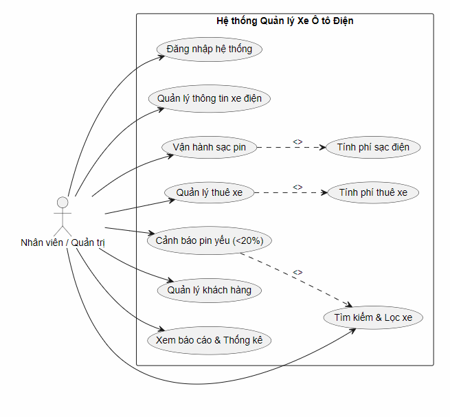

BÀI TẬP: HỆ THỐNG QUẢN LÝ XE Ô TÔ ĐIỆN (JAVA)
1. Thông tin nhóm
Lớp: [OOAD IT25M]
Nhóm: [13]
Họ và tên:
1.Đỗ Văn Hậu
2.Triệu Quang Mười.
2. Mục tiêu đề tài
Xây dựng ứng dụng quản lý xe ô tô điện nhằm áp dụng các kiến thức cốt lõi của môn Phân tích Thiết kế Hướng đối tượng (OOAD) & Lập trình Hướng đối tượng (OOP) với Java:
Áp dụng 4 tính chất: Kế thừa (Inheritance), Đóng gói (Encapsulation), Đa hình (Polymorphism), Trừu tượng (Abstraction).
Xử lý cấu trúc dữ liệu (Collections: ArrayList, HashMap) và xử lý ngoại lệ (Exception Handling).
Thao tác lưu trữ dữ liệu (Đọc/ghi File hoặc JDBC/MySQL).
3. Phạm vi và Thực thể quản lý
Xe ô tô điện: Mã xe, Biển số, Hãng sản xuất, Model, Năm sản xuất, Dung lượng pin (kWh), % pin hiện tại, Tầm vận hành tối đa (km), Trạng thái (Rảnh / Đang sạc / Đang cho thuê / Bảo trì).
Trạm sạc: Mã trạm, Tên trạm, Loại cổng sạc (AC thường / DC nhanh), Lịch sử sạc (thời gian, kWh nạp, số tiền).
Khách hàng / Tài xế: Mã khách hàng, Họ tên, CCCD, Số điện thoại, Hạng bằng lái.
Hợp đồng thuê / Giao dịch: Mã giao dịch, Xe thuê, Khách hàng, Thời gian bắt đầu - kết thúc, % pin nhận - trả, Thành tiền.
4. Yêu cầu hệ thống (System Requirements)
4.1. Yêu cầu chức năng (Functional Requirements - FR)
FR1 - Quản lý xe điện (CRUD): Thêm mới, chỉnh sửa thông tin, xóa và hiển thị danh sách các xe ô tô điện.
FR2 - Tìm kiếm và lọc xe: Tra cứu nhanh xe theo biển số, hãng sản xuất, mức % pin hoặc trạng thái hoạt động.
FR3 - Cảnh báo mức pin thấp: Tự động phát hiện và lọc danh sách các xe có mức pin dưới 20% cần cắm sạc.
FR4 - Nghiệp vụ sạc điện: Mô phỏng quá trình nạp pin theo thời gian và công suất cổng sạc; tự động tính tiền điện dựa trên số kWh tiêu thụ và đơn giá trạm sạc.
FR5 - Quản lý hợp đồng & Cho thuê xe: Tạo hợp đồng thuê xe, cập nhật trạng thái xe sang "Đang cho thuê", ghi nhận mức pin lúc bàn giao và lúc trả xe, tính tổng chi phí thuê.
FR6 - Quản lý thông tin khách hàng: Lưu trữ và quản lý thông tin khách hàng (CCCD, SĐT, bằng lái) liên kết với lịch sử thuê xe.
FR7 - Báo cáo & Thống kê: Thống kê tỷ lệ xe theo từng trạng thái (Rảnh, Đang sạc, Đang thuê, Bảo trì), tổng kết doanh thu cho thuê và doanh thu trạm sạc.
FR8 - Lưu trữ dữ liệu: Hỗ trợ đọc/ghi dữ liệu ra tệp tin (File I/O) để bảo toàn dữ liệu sau mỗi phiên làm việc.
4.2. Yêu cầu phi chức năng (Non-Functional Requirements - NFR)
NFR1 - Tính hợp lệ & Toàn vẹn dữ liệu: Kiểm tra nghiêm ngặt dữ liệu đầu vào (mức pin trong khoảng 0–100%, số điện thoại 10 chữ số, định dạng biển số xe).
NFR2 - Tính mở rộng & Chuẩn OOP: Thiết kế phân lớp rõ ràng (Model, Service, Repository), dễ mở rộng thêm các loại phương tiện mới hoặc phương thức thanh toán mới.
NFR3 - Xử lý ngoại lệ (Exception Handling): Bắt và thông báo lỗi rõ ràng khi người dùng thao tác sai (trùng mã xe, nhập sai kiểu dữ liệu), tránh tình trạng dừng chương trình đột ngột.
5. Cấu trúc mã nguồn dự kiến & Công nghệ
src/
├── model/          # Vehicle, ElectricCar, ChargingStation, Customer, Contract

├── service/        # Các Interface và Service xử lý logic nghiệp vụ

├── repository/     # Đọc/ghi dữ liệu từ file hoặc Database

└── main/           # Main.java - Giao diện dòng lệnh (CLI) điều khiển chương trình

Ngôn ngữ: Java (JDK 17+)
Quản lý mã nguồn: Git, GitHub
Lưu trữ: File I/O (Text File / Object Serialization)
6. 
