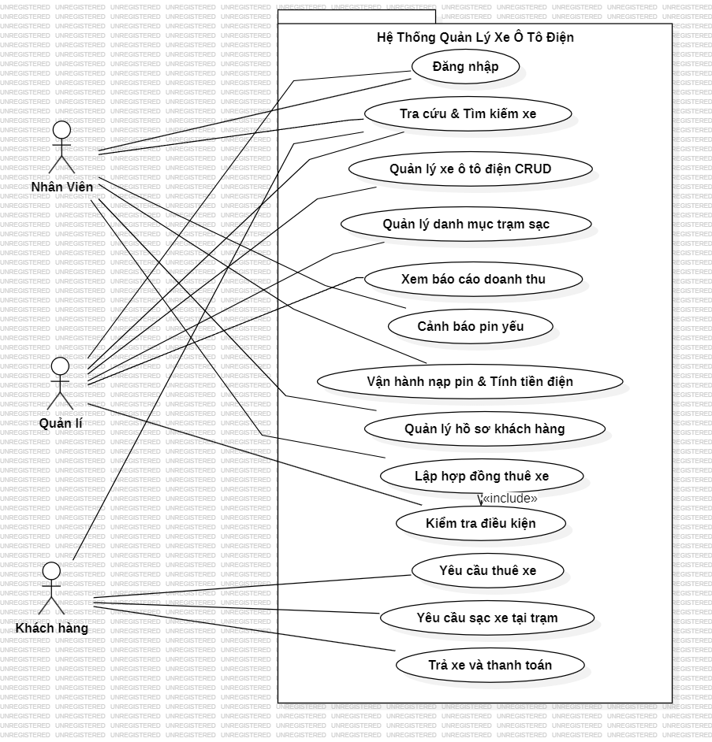

# BÀI TẬP NHÓM: HỆ THỐNG QUẢN LÝ XE Ô TÔ ĐIỆN (JAVA)
**Học phần:** Phân tích và Thiết kế Hướng đối tượng (OOAD)  
**Lớp:** OOAD IT25M | **Nhóm:** 13  
**Thành viên thực hiện:**
1. Đỗ Văn Hậu
2. Triệu Quang Mười
1. Phát biểu bài toán và Nghiệp vụ hệ thống
1.1. Hiện trạng và Đặt vấn đề
- Sự chuyển dịch từ phương tiện sử dụng nhiên liệu hóa thạch sang xe thuần điện mang lại nhiều lợi ích về môi trường nhưng đồng thời đặt ra thách thức lớn trong khâu quản lý vận hành. Khác với dòng xe truyền thống chỉ mất vài phút để đổ xăng, việc khai thác xe điện gắn liền chặt chẽ với tình trạng dung lượng pin, thời gian nạp xả, công suất của hạ tầng trạm sạc và phạm vi di chuyển an toàn còn lại trước mỗi hành trình.

- Tại nhiều cơ sở kinh doanh dịch vụ và vận hành phương tiện hiện nay, việc quản lý vẫn phụ thuộc nhiều vào sổ sách hoặc các công cụ ghi chép thủ công rời rạc. Điều này dẫn đến các vấn đề nghiêm trọng như: bàn giao xe cho khách khi dung lượng pin không đảm bảo an toàn, để xe cạn kiệt pin dưới ngưỡng cho phép gây giảm tuổi thọ cell pin, tính toán sai lệch chi phí nạp điện tại các trụ sạc AC thường và DC nhanh, cũng như thiếu sự đồng bộ dữ liệu giữa bộ phận kinh doanh và bộ phận kỹ thuật. Do đó, việc xây dựng một hệ thống phần mềm quản lý thống nhất, tự động hóa quy trình nghiệp vụ nội bộ là giải pháp cấp thiết nhằm nâng cao hiệu quả vận hành và an toàn kỹ thuật.

1.2. Mô tả nghiệp vụ thực tế và Yêu cầu xử lý của hệ thống
- Hệ thống phần mềm được thiết kế nhằm số hóa toàn diện quy trình vận hành phương tiện, kết nối chặt chẽ các khâu dịch vụ trong doanh nghiệp thông qua các yêu cầu xử lý nghiệp vụ:
- Quản trị phương tiện và hạ tầng kỹ thuật: Hệ thống theo dõi chi tiết toàn bộ hồ sơ kỹ thuật của từng xe điện, bao gồm mã định danh, biển số, hãng sản xuất, dòng xe, năm sản xuất, dung lượng pin thiết kế (kWh), phần trăm dung lượng pin thực tế và cự ly di chuyển tối đa. Song song đó, hệ thống quản trị danh mục hạ tầng trạm sạc nội bộ với các thông số về chuẩn sạc (sạc tiêu chuẩn AC hoặc sạc nhanh DC), công suất hoạt động và đơn giá điện áp dụng trên mỗi kWh tiêu thụ.
- Xác thực và quản lý thông tin khách hàng: Trước khi thực hiện bất kỳ giao dịch nào, hệ thống tiếp nhận và lưu trữ thông tin cá nhân khách hàng gồm họ tên, căn cước công dân và số điện thoại liên lạc. Để đảm bảo tính pháp lý và an toàn giao thông, hệ thống bắt buộc kiểm tra hạng giấy phép lái xe hợp lệ trước khi cho phép bàn giao phương tiện.
- Quy trình cho thuê và hoàn trả phương tiện: Hệ thống áp dụng quy tắc kiểm soát nghiêm ngặt đối với xe xuất xưởng: chỉ cho phép lập giao dịch thuê đối với những xe đang ở trạng thái rảnh và có dung lượng pin tối thiểu từ 50% trở lên. Khi hợp đồng được khởi tạo, hệ thống ghi nhận thời điểm bắt đầu, thời gian dự kiến kết thúc, đơn giá thỏa thuận và tự động khóa trạng thái xe sang "Đang cho thuê". Khi khách hàng hoàn trả xe, hệ thống tiến hành nghiệm thu mức pin thực tế, đối soát thời gian sử dụng để tính toán tổng chi phí và thanh lý hợp đồng.
- Giám sát năng lượng, cảnh báo và điều phối nạp pin: Hệ thống liên tục quét mức năng lượng của toàn bộ đội xe trong bãi. Ngay khi phát hiện phương tiện có mức pin tụt xuống dưới 20%, hệ thống tự động phát tín hiệu cảnh báo pin yếu để đưa xe vào khu vực nạp sạc khẩn cấp. Trong quá trình sạc, hệ thống mô phỏng chu kỳ nạp dựa trên công suất trạm, tự động đo lường lượng điện năng tiêu thụ (kWh) và quy đổi thành tiền theo đơn giá quy định. Khi hoàn tất phiên sạc hoặc bảo dưỡng, phương tiện được chuyển về trạng thái sẵn sàng phục vụ.
- Báo cáo tài chính và toàn vẹn dữ liệu: Hệ thống tổng hợp báo cáo định kỳ về tỷ lệ trạng thái xe (rảnh, đang sạc, đang cho thuê, bảo trì) và tổng hợp doanh thu từ hai nguồn: dịch vụ cho thuê xe và dịch vụ sạc điện. Dữ liệu hoạt động được sao lưu tự động ra hệ thống tệp tin (File I/O) theo cấu trúc chuẩn, đảm bảo tính toàn vẹn và khôi phục trạng thái làm việc chính xác sau mỗi lần khởi động.
2. Biểu đồ Use Case (Use Case Diagram): Em đã tự vẽ bằng StarUML 
3. Đặc tả Ca sử dụng tiêu biểu (Use Case Specification)
Use Case: Lập hợp đồng cho thuê xe

- Hồ sơ khách hàng đã tồn tại trên hệ thống và có giấy phép lái xe hợp lệ.
- Xe điện được chọn đang ở trạng thái "Rảnh" và mức pin hiện tại $\ge 50\%$. |
| Điều kiện kết thúc | - Hợp đồng thuê xe được tạo và lưu trữ thành công.
- Trạng thái của xe được tự động chuyển sang "Đang cho thuê". |
| Luồng sự kiện chính (Basic Flow) | 1. Nhân viên chọn chức năng lập hợp đồng thuê xe trên hệ thống.
- Nhập mã khách hàng (hoặc số CCCD) và mã xe cần thuê.
- Hệ thống kiểm tra điều kiện ràng buộc: xác minh bằng lái của khách và đảm bảo mức pin của xe $\ge 50\%$.
- Nhân viên nhập thời gian thuê dự kiến và mức đơn giá áp dụng.
- Hệ thống ghi nhận tỷ lệ % pin ban đầu tại thời điểm giao xe.v
- Hệ thống tạo mã giao dịch, lưu hợp đồng và tự động cập nhật trạng thái xe thành "Đang cho thuê".
- Hệ thống xuất thông báo xác nhận giao dịch thành công và hiển thị hợp đồng. || Luồng sự kiện rẽ nhánh (Alternative Flow) | - 3a. Xe không đạt điều kiện xuất xưởng: Nếu xe có pin $< 50\%$ hoặc đang ở trạng thái khác (đang sạc, bảo trì), hệ thống từ chối khởi tạo, thông báo lỗi và yêu cầu đổi xe.
3b. Khách hàng chưa đăng ký: Nếu thông tin khách hàng không tồn tại, hệ thống đưa ra thông báo và yêu cầu tạo mới hồ sơ trước khi tiếp tục. |
